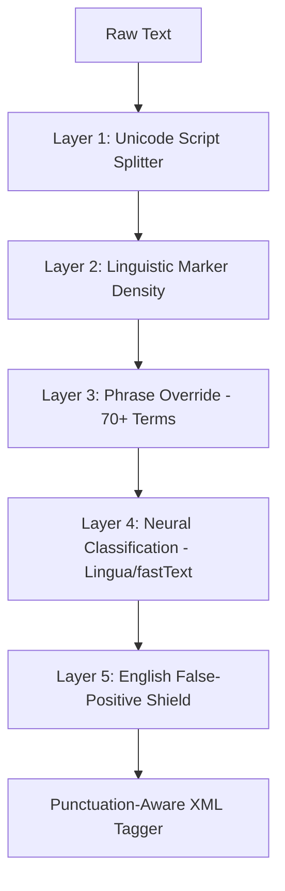

# Architecture: Multilingual Manuscript Identifier

The system is designed as a **Hierarchical Decision Engine** that balances machine learning detection with linguistic heuristics and script-aware tagging.

## 1. System Workflow

---

## 2. Detection Layers

### Layer 1: Unicode Script Splitter (`unicode_script.py`)
- **Action**: Partitions text by Unicode script blocks (Latin, Arabic, CJK, Indic).
- **Goal**: Ensures script unification (e.g., Keeping Japanese Kanji and Hiragana together) before any machine learning analysis.

### Layer 2: Density Analysis (`segmenter.py`)
- **Action**: Scans for "Linguistic Markers" (e.g., `la, el, der, die, une, est`).
- **Threshold**: If a sentence has a high density of markers, it is tagged as a cohesive **Block**.
- **Impact**: Prevents fragmented tagging in pure foreign sentences (e.g., long Spanish/Italian paragraphs).

### Layer 3: Phrase Override (`segmenter.py`)
- **Action**: Recursive regex search for 70+ "Famous Phrases" (*Ikigai, C'est la vie, La dolce vita, Kultur*).
- **Priority**: Authoritative Layer; skips ML models to ensure 100% ISO code accuracy for common terms.

### Layer 4: Neural Classification (`lang_detector.py`)
- **Action**: Competitive check between **Lingua** (precision) and **fastText** (robustness).
- **Verification**: Employs a strict confidence threshold (0.85 for Latin) to prevent false positives.

### Layer 5: English Shield (`segmenter.py`)
- **Action**: Final check against a 400+ word English "Skip-list".
- **Goal**: Protects common English technical terms (*metrics, figure, conclusion*) and function words from being tagged as foreign.

---

## 3. Formatting Engine (`tagger.py`)

The final stage performs **Context-Aware Punctuation Stripping**:

- **Western Scripts (Spanish, German, etc.)**: Automatically detects and moves trailing punctuation (`. , ! ? ; :`) **outside** the `<lang>` tag (e.g., `...paz</lang>.`).
- **RTL & CJK Scripts**: Preserves punctuation **inside** the tag to maintain script-specific semantic unity (e.g., `<lang xml:lang="he">.השלום...</lang>`).

---

## 4. Verification & Testing

- **`verify_benchmark.py`**: Automated regression test for the 11 base samples.
- **`check_user_input.py`**: Forces 100% parity against the most recent user-provided "Cross-Check" (Step 1247) to ensure zero regressions.
